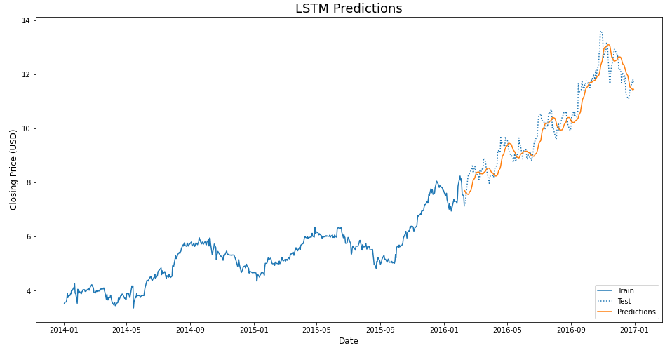

# Stock Price Prediction
Solution to the stock market prediction problem.

## Problem description
predict the daily closing price of US stocks for a selected company using past 60 days 
of stock market data.

## Datasets
I used two different datasets for this project:

| dataset  |  description |
|---|---|
| [US Stocks & ETFs - Tickers, Company Info, Logos](https://www.kaggle.com/marketahead/all-us-stocks-tickers-company-info-logos#companies.csv)  |a dataset of available US stock and ETF tickers with some other information|
| [Huge Stock Market Dataset](https://www.kaggle.com/borismarjanovic/price-volume-data-for-all-us-stocks-etfs/data)  | the full historical daily price and volume data for all US-based stocks and ETFs trading on the NYSE, NASDAQ, and NYSE MKT. It's one of the best datasets of its kind you can obtain.  |

For detailed information, click on the name of the dataset. 

To run my notebook, you should first download both datasets to the ../data/ folder. Do not unzip the *Huge Stock Market Dataset*.

## Result

